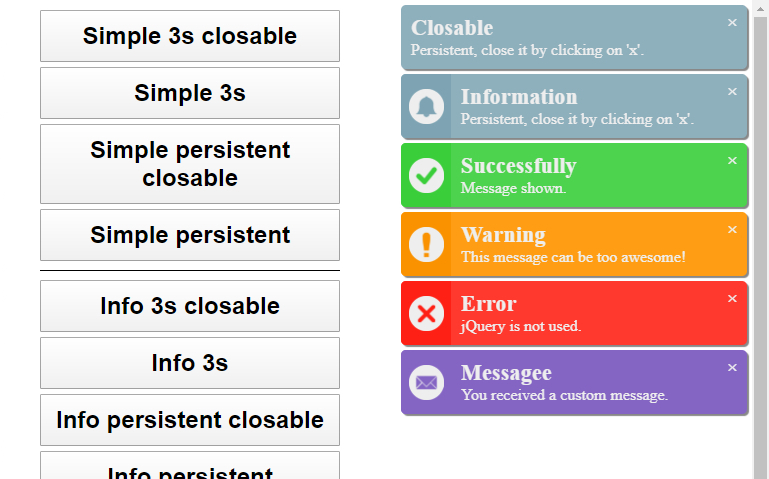

# SlimNotifierJs
A slim JS library for notifications.
Simply include the script (`<script src="slim_notifier.js"></script>`) and call a notification function. 
You can also create your own notification types.
```javascript
/*
 * There are four predefined types of notification
 * - simple
 * - info (same as simple but with an icon)
 * - success
 * - warning
 * - error
 */
SlimNotifierJs.notification('error', 'Error', 'jQuery is not used.', 3000, false);
// You can also create your own notification type - For example, for incoming messages
SlimNotifierJs.addType('envelope', {
    outerBorder: 'none',
    innerBorder: 'none',
    textBG: '#8565c4',
    iconBG: '#8565c4',
    color: '#eeeeee',
    titleFontSize: '1.4em',
    textFontSize: '1em',
    icon: 'envelope.png'
});
// You can use the custom created types like the predefined ones
SlimNotifierJs.notification('envelope', 'Messagee', 'You received a custom message.', 3000);
```

